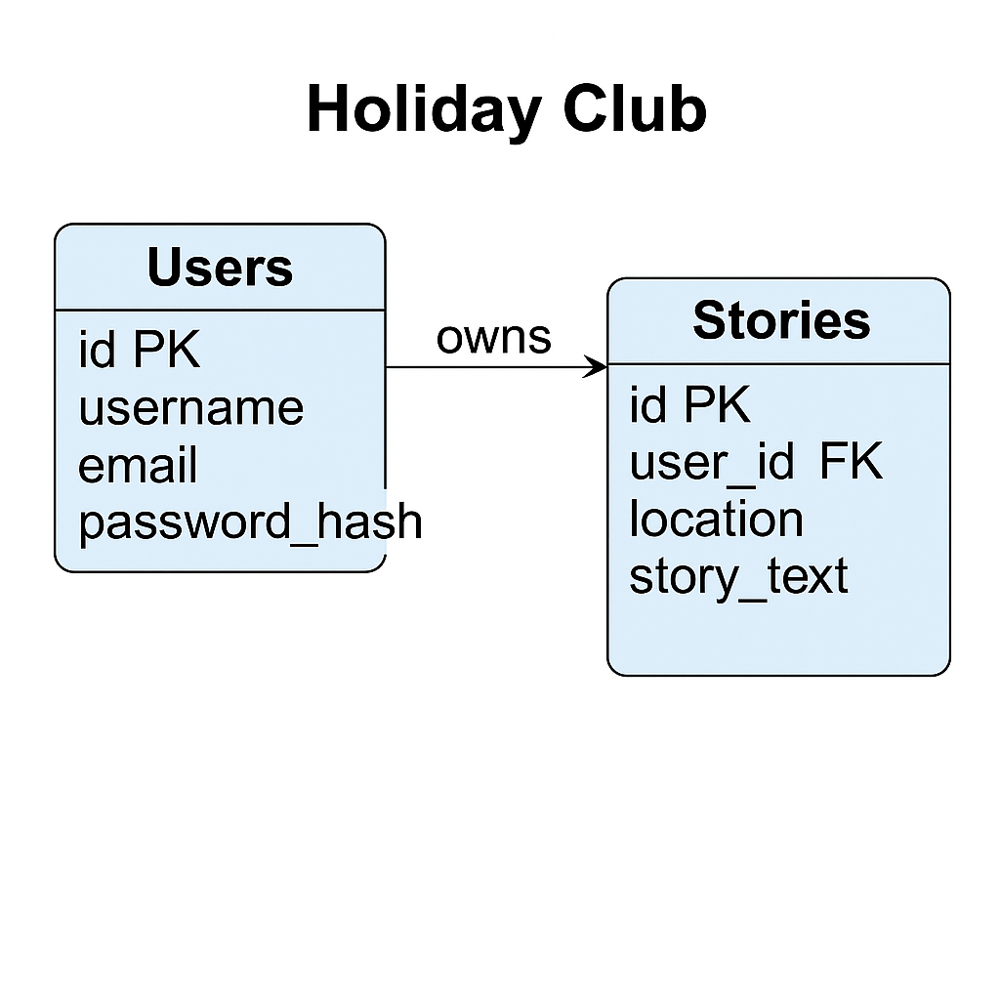

# Holiday Club  
https://your-holiday-club-d5454424f4de.herokuapp.com/  
**Author**: Aleksandar Husagic  

Holiday Club is a community-driven Flask web application where travelers register, share, and explore holiday stories. It demonstrates a fully relational design (users ↔ stories), is mobile-responsive, supports dark mode, and includes a full manual testing plan to verify functionality, usability, data integrity, and deployment.

---

## Table of Contents

1. [Project Description](#project-description)  
2. [User Stories](#user-stories)  
3. [Features](#features)  
4. [Technologies](#technologies)  
5. [Database Structure](#database-structure)  
6. [Data Model](#data-model)  
7. [Manual Testing](#manual-testing)  
8. [Code Validation](#code-validation)  
9. [Deployment](#deployment)  
10. [Installation & Usage (Local)](#installation--usage-local)  
11. [License](#license)  

---

## Project Description

Holiday Club allows registered users to:

- **View** all holiday stories in a responsive grid.  
- **Read** each story in detail (with images).  
- **Add** a new holiday story.  
- **Edit** their own stories.  
- **Delete** their own stories.  

It fosters a collaborative environment for sharing travel experiences and tips.

---

## User Stories

1. **Visitor**: As a visitor, I can browse all travel stories to discover new destinations.  
2. **Contributor**: As a registered user, I can add my own travel story so others can read it.  
3. **Returning User**: As an author, I can edit my previous stories to correct or add details.  
4. **Account Owner**: As an author, I can delete my own stories if I choose.  
5. **Inquirer**: As any visitor, I can send feedback or questions via a contact form.

---

## Features

- **Authentication**: Register, log in, log out (with secure hashed passwords).  
- **Authorization**: Only story authors may edit/delete their own entries.  
- **CRUD**: Create, read, update, and delete stories.  
- **Responsive Design**: Adapts to mobile and desktop, includes a hamburger menu.  
- **Dark-Mode Toggle**: Switch between light and dark themes.  
- **Flash Messages**: Success/error feedback after every action.  
- **Seed Data**: A default user and sample stories are inserted on first run (idempotent).  
- **Contact Form**: Visitors may send inquiries to the admin.

---

## Technologies

- **Backend**: Python 3.9+, Flask  
- **Database**: SQLite (via `sqlite3`)  
- **Templating**: Jinja2 (HTML)  
- **Styling**: CSS3, minimal JavaScript for toggles  
- **WSGI Server**: Gunicorn  
- **Hosting**: Heroku  

---

## Database Structure

This relational schema satisfies the requirement for relevant, normalized tables with proper foreign-key relationships:

- **`users`**  
  - `id` INTEGER PK  
  - `username` TEXT UNIQUE  
  - `email` TEXT  
  - `password_hash` TEXT  
  - `created_at` DATETIME (optional timestamp)  

- **`stories`**  
  - `id` INTEGER PK  
  - `user_id` INTEGER FK → `users.id`  
  - `location` TEXT  
  - `story_text` TEXT  
  - `created_at` DATETIME  
  - `updated_at` DATETIME  

Each story belongs to exactly one user. We seed a `default_user` on first run and link sample stories, demonstrating the one-to-many relationship in practice.

---

## Data Model

Below is an ER diagram illustrating tables, keys, and relationships:

  

**Additional tables** (for future expansion):

 These tables are part of the project’s data model design to demonstrate foresight and expansion capability. Although not fully implemented in the frontend, they reflect a scalable architecture that could support future features like story tagging or comments.

| Table                | Columns                                                                                                              |
|----------------------|----------------------------------------------------------------------------------------------------------------------|
| **comments**         | `id` PK, `story_id` FK→stories.id, `user_id` FK→users.id, `comment_text`, `created_at`                               |
| **tags**             | `id` PK, `name` UNIQUE                                                                                                |
| **story_tags**       | `story_id` FK→stories.id, `tag_id` FK→tags.id (composite primary key)                                                |
| **contact_messages** | `id` PK, `name`, `email`, `message`, `created_at`                                                                    |

---

## Manual Testing

| Area               | Test Case             | Steps                                                                                                 | Expected Result                                                          |
|--------------------|-----------------------|-------------------------------------------------------------------------------------------------------|--------------------------------------------------------------------------|
| **Home Page**      | Load Home             | 1. Go to `/`                                                                                          | Hero banner, “View Stories” button, navbar links appear.                |
| **Navigation**     | Nav Links             | 1. Click About, Contact, Stories, Login/Register                                                      | Correct pages load, active link highlights.                             |
| **About Page**     | Content & Layout      | 1. Go to `/about`                                                                                     | Mission, future plans, quotes render correctly.                         |
| **Contact Form**   | Submit & Validate     | 1. Go to `/contact` 2. Fill Name, Email, Message 3. Submit                                       | Flash “Thank you…” on valid; error flash on empty.                      |
| **Register**       | New User              | 1. `/register` → valid data → Submit                                                                  | Flash success, redirect to login.                                        |
| **Register**       | Duplicate Username    | 1. Register same username again                                                                        | Flash “Username already taken.”                                         |
| **Login/Logout**   | Valid & Invalid       | 1. `/login` → correct creds → Home, navbar shows “Hi, USER” 2. Click Logout                           | Flashes “Welcome, USER!” then “You’ve been logged out.”                  |
| **View Stories**   | List Seeded Stories   | 1. `/viewstory`                                                                                        | Stories show in grid with location, author, excerpt, “Read More.”        |
| **Story Detail**   | View & 404            | 1. Click “Read More” → valid ID / invalid `/story/9999`                                                | Valid ID shows full detail; invalid ID flashes “Story not found!”.      |
| **Add Story**      | Auth & Validation     | 1. Login → `/addstory` → fill fields → Submit / empty submit                                           | Auth required redirect; success or validation flash.                    |
| **Edit Story**     | Ownership & Validate  | 1. Login as owner → `/editstory/<id>` → change → Submit / empty                                         | Only owner allowed; success or validation flash.                        |
| **Delete Story**   | Ownership             | 1. Login as owner → `/deletestory/<id>` → confirm                                                      | Only owner allowed; success flash & removal.                            |
| **Responsive**     | Mobile View           | 1. Resize < 768px or DevTools mobile emulation                                                         | Navbar collapses; grids adjust to 1–2 columns.                          |
| **Dark Mode**      | Toggle Dark Mode      | 1. Click 🌙 button                                                                                     | Dark styles apply site-wide.                                             |
| **Data Persistence**| Refresh & Re-login    | 1. Add/Edit/Delete → refresh → logout/login                                                            | All changes remain in place.                                            |

---

## Code Validation

- **HTML/CSS** validated via [W3C Markup Validator](https://validator.w3.org/) and [W3C CSS Validator](https://jigsaw.w3.org/css-validator/).  
- **Python** code conforms to **PEP 8** (checked with `flake8`/`black`), uses `if`/loops, meaningful names, comments, and no commented-out dead code.  
- All secret keys loaded via environment variables; no passwords in source, `DEBUG=False` in production.

---

## Deployment

**Documenting the full Heroku deployment process:**
 
- 1. On Heroku create an account and log in. 
- 2. Click new and create new app. 
- 3. Choose a unique name for your app, and click on create App
- 4. From terminal type  $ heroku login
- 6. echo "web: gunicorn app:app" > Procfile
- 7. Initiliaze git:
- git init
- git add .
- git commit -m "Initial commit"
- 8. Connect to Heroku remote:
- heroku login
- heroku git:remote -a your-holiday-club
- 9. Add Config Vars (in Heroku dashboard):
- SECRET_KEY = your_production_secret
- DATABASE = holiday_club.db
- 10. type $ git push heroku main
- 11. heroku open
- 12. In the app dashboard, under Settings click on Reveal Config Vars
- 13. Once the build is complete, go back to Heroku and click on Open App

## Disclaimer

This project was created for educational use only.